# FARTS
**F**abi **A**nd **R**ené's **T**raining-data **S**ynthesizer

Generating synthetic datasets to improve inference on all sorts of computer-vision tasks that specifically involve insects. Like, lots of them.

## Brining 3D models into Unreal (Blender to Unreal)

### Requirements:
* [Blender](https://www.blender.org/) (v3.0.1 or later)
* [send2unreal](https://github.com/EpicGames/BlenderTools) (v2.1 or later)
*	Unreal engine (installed via Epic Games Launcher, see above, v5.0.2 or later)
*	*Patience.*

1. download [send2unreal](https://github.com/EpicGames/BlenderTools) and don't unzip the file. You can install the addon in its zipped form straight from Blender. In Blender, under **edit/preferences/Add-ons** click on **Install...** and navigate to the **send2ue** zip file on your computer.

2. You should now see a new top at the top of your Blender Window, named **Pipeline**. Click on it, and then select **Export/Settings_Dialog** to configure how we want things to be sent over to Unreal.

3. Inside the **Paths** tab, enter the desired location of your mesh / textures / armatures inside the Unreal project. In our case, this will be **Game/Subjects/NAME_OF_YOUR_SPECIMEN**. You will have to manually create the **NAME_OF_YOUR_SPECIMEN** folder inside the **Subjects** folder of the Unreal project, but this will make it possible to make changes to our model in Blender and simply send the updated version over to Unreal without having to set up everything again.

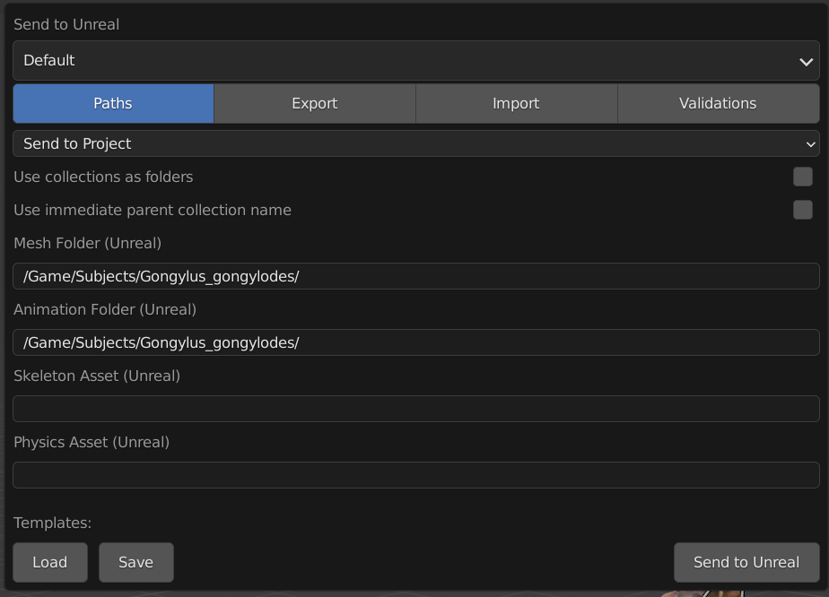

4. Double check the export settings, specifically the **.FBX** settings. We want **Apply Unit** to be checked, the Z axis to be up, and NO leaf bones to be added.

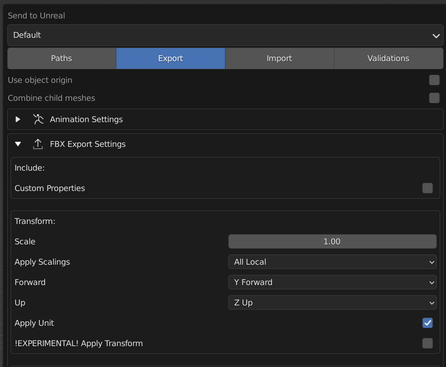

5. If everything went according to plan, you should also be able to see an additional folder in your **Scene Collection** titled **Export**. Anything we place in here, Unreal will attempt to import, when we are ready to click on **Send to Unreal** (But don't do that now. We still have a few things to check first.)

6. If you haven't done that already, launch **FARTS.uproject** by double clicking on the file. We need to check whether Unreal has the right plugins enabled to receive data from our Blender instance. Click on **Settings** (top left) and then on **Plugins**.

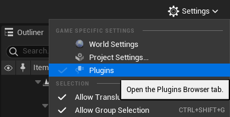

7. Check, whether the **Editor Scripting Utilities** and **Python Ediotor Script** plugins are activated. If they are not, enable them now.

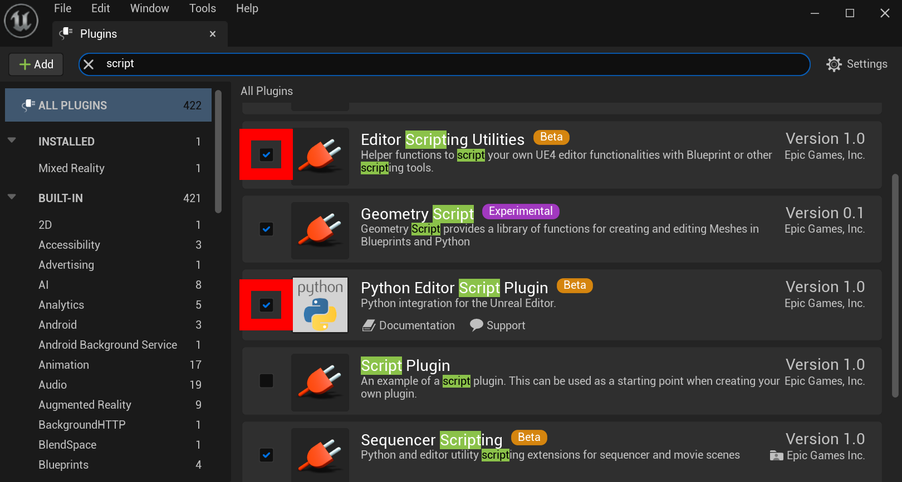

Nice one! Installation-wise we are done! 
Time to prepare a model in Blender to send over and configure for generating some data!

## Preparing models in Blender for Unreal

Generally, the lower the vertex count, while still appearing realistic, the better. Unreal engine deals very well with reidiculous numbers of polygons, but simulating hundreds of high resolution insects can still be a challenging task for your machine. 
Aim for >20,000 triangles inside your model, and you are good. For details, refer to our [**01 Retopologising 3D models guide**](01_Retopologising_3D_models.md).

To make use of our provided animation blueprints, follow our [standard rigging convention](../example_data/base_rig.blend),
as detailed in the [**02 Rigging 3D models guide**](02_Rigging_3D_models.md).

 

In theory, any model and rig combination is possible. Make sure, your model is posed with all tarsi in ground 
contact in a somewhat natural pose. This is important, as we are going to use IK solvers to have the appendages 
interact with elements in the generated environment.

#### Attention:
This guide assumes that your model is already [**01 retopologised**](01_Retopologising_3D_models.md) and
[**02 rigged**](02_Rigging_3D_models.md)! So let's get started:

1. **Apply** your **armature** in the **modifier** tab, and **delete all vertex groups**. We need to do this once, so all units and joint orientations will scale correctly.

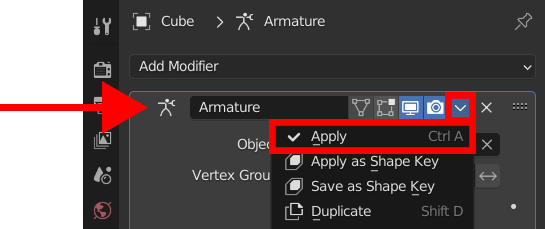

2. Apply all transforms (scale, rotation, position) to your mesh. In Object mode, select the mesh, hit "ctrl + a" and select All Transforms. Repeat this step for the armature. Without applying transforms, Unreal and Blender will throw all sorts of fun error messages at you. Nobody wants that.

3. Now select the **armature** and go into **pose mode**. Click **Pose > Apply > Apply Pose** as Rest Pose, to make the current pose the default.

4. Parent the mesh back to the armature with automatic weights. Double check the influence of each joint via **weight painting**. If joints affect unwated areas, this will lead to unrealistic generated poses.

*	[Optional] Create Normal maps. This can be done either in Blender directly by baking a normal map as an additional image texture (see texture baking), in Photoshop, or, nowadays it seems, in literally any image editing program… However, it’s best to do it directly in Blender to preserve information between unwrapped regions, which avoids sharp artifacts between islands in the unwrapped texture.

5. Finally, in the **Scene Collection** move both your armature and your mesh into the **Export** collection. Now you can click on **Pipeline > Export > Send to Unreal**. Remember, your Unreal project needs to be open in order for this to work, and you must have created the specified folder referenced in the export settings (see step 3 of the installation guide above)

… and hope for the best.

## Including new models in the generator (Unreal)

1. Check your transferred models in the Content browser to ensure they made it over to the Unreal Project.

2. Create a material instance from **Subjects/M_Subject01_SSInsects** and drag it into your model folder.

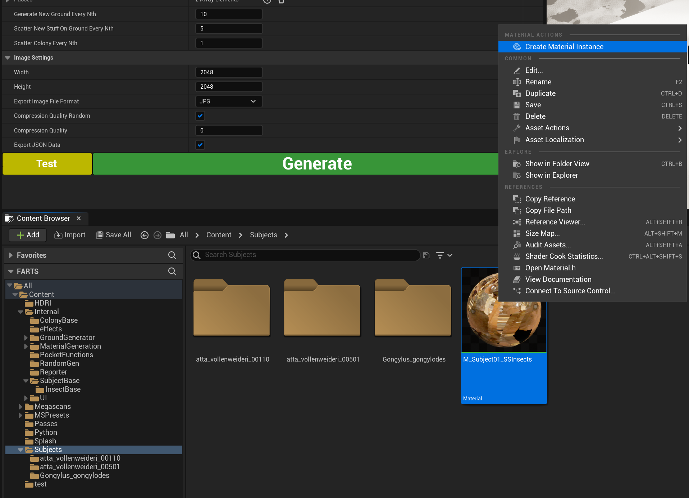

3. Open the material instance and replace the existing textures (albedo & optionally normal) with your own. (In case these materials are not editable, instead of making a **material instance** of **Subjects/M_Subject01_SSInsects**, make a **copy** of it and try again.)

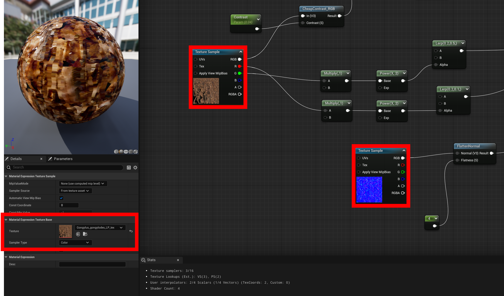

4. Assign the **SK_InsectBase_Skeleton** to your skeletal mesh by right clicking it and selecting **Skeleton > Assign Skeleton**.

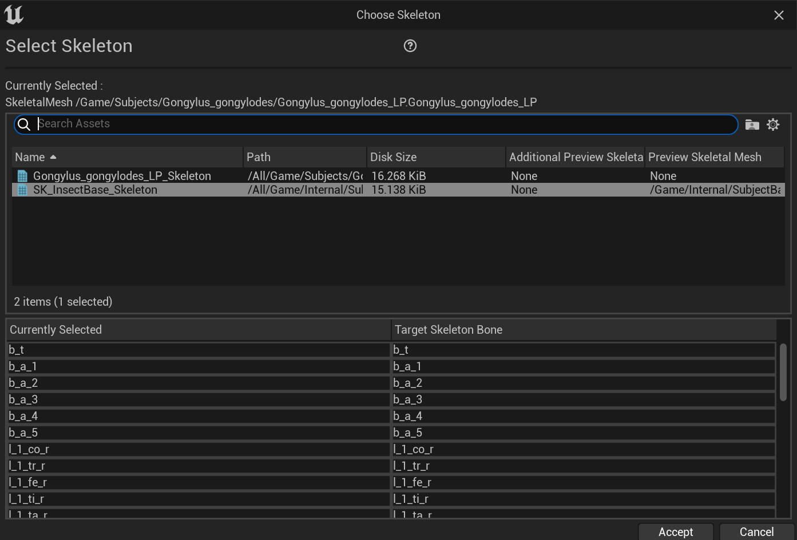

**Quick note:**

In some cases, you will see an additional skeletal element listed here, named **root**, which may prevent assigning the
skeleton correctly (If you proceed, the animation blueprints may no longer work correctly for this particular mesh).

Double-check (in Blender) whether your **Armature** follows the same naming convention as our [base_rig](../example_data/base_rig.blend).
Refer to the [**Troubleshooting guide**](troubleshooting.md) for additional guidance.

5. Compute the low-poly collision mesh from the **Physics Asset** of your imported mesh. Open the **Physics Asset** and delete any hierarchy that is already present. Then, under Tools (right side) match the parameters shown in the image below and click on **Genrate All Bodies**.

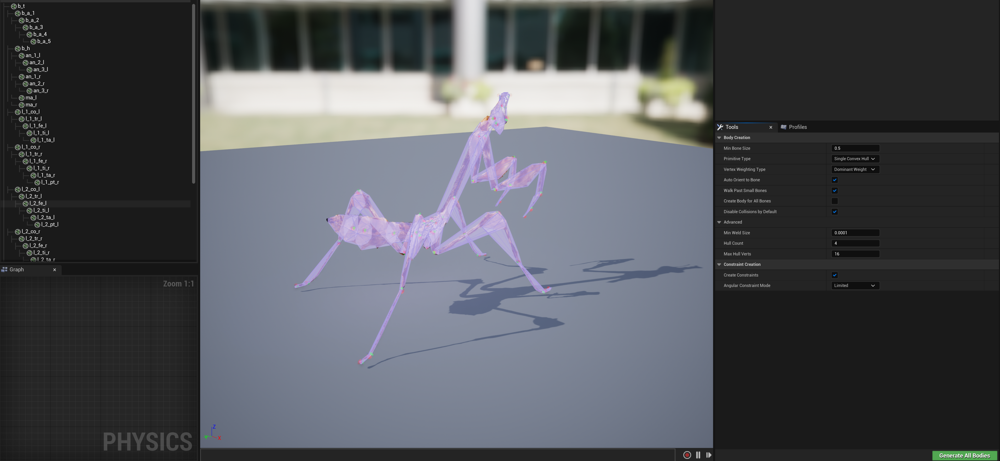

6. Create a **Child Blueprint Class** from **SubjectBase/BP_sbj_InsectBase** and also move it into your mesh folder.

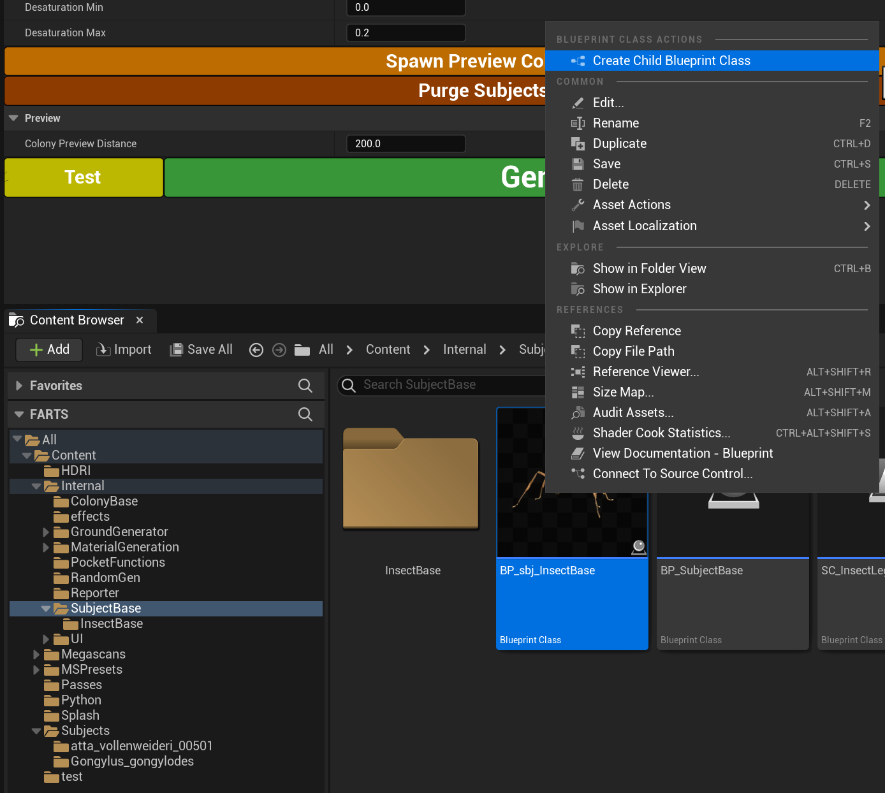

7. Rename the **Child Blue Print Class** to something more fitting of the newly added mesh so we can find it when we want to select it inside the generator. Then open the file. Now, provide a "Class name" which is how your subject model will be referred to in the generated **Batch Data File**.

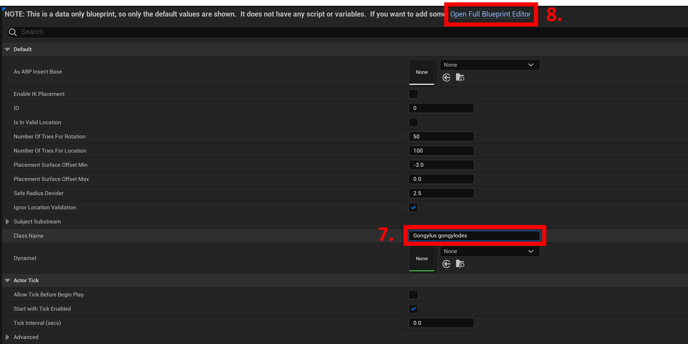

8. Click on **Open Full Blueprint Editor**. In there, select the **Insect_SkeletalMesh** on the left side and then make the following changes on the right side:

* for the **Anim Class**, select **ABP_InsectBase_C**
* for the **Skeletal Mesh**, select your newly imported skeletal mesh
* for the **Materials > Element 0**, select the created **Material Instance** (not the original material, as otherwise the generator cannot apply variations to it at runtime)

9. Select your new mewly created **Child Blue Print Class** as part of your **Colony** in the **FARTS_Interface**, under **Colony > Types**. You can also add additional subjects here, the sky is the limit. By pressing on **Spawn Preview Colony** you can see what your generated colony will look like. (You may need to move to the top of the generated world, where the **Colony Preview Groundplane** is located.

10. **You did it!**  (well, hopefully) 

If everything has gone according to plan, you should now be able to hit **Generate** and watch the magic happen. 
In the [next section](04_Generating_your_first_dataset.md), we will detail what each of the generator parameters does.

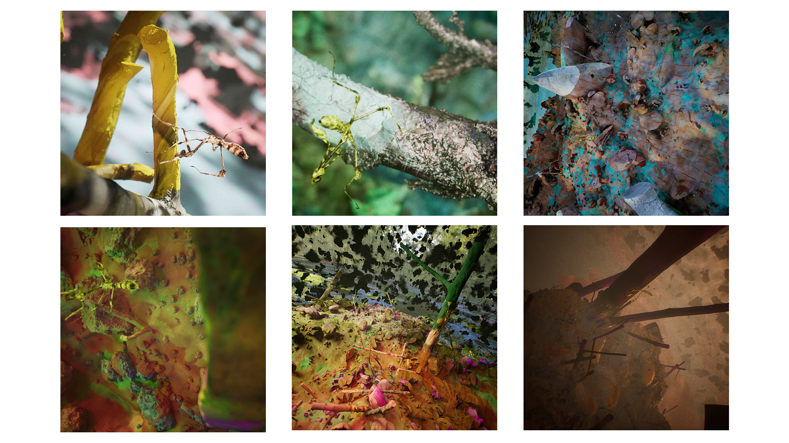

### Next up: 
> [**04 Generating your first dataset**](04_Generating_your_first_dataset.md)