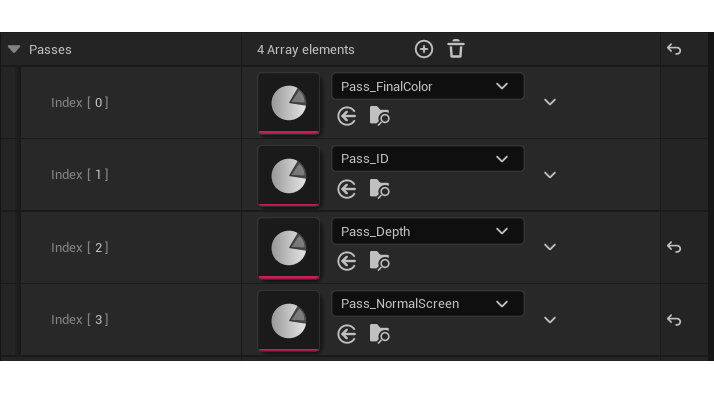
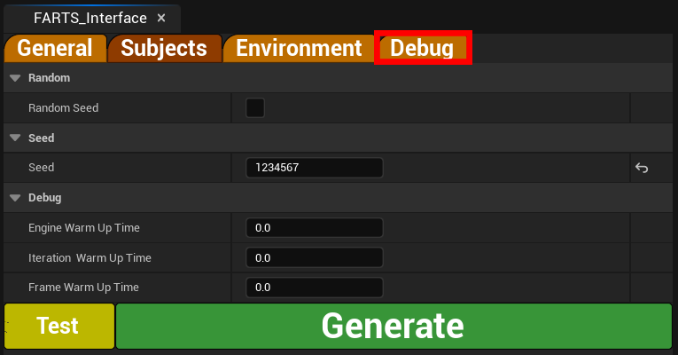

# FARTS

**F**abi **A**nd **R**ené's **T**raining-data **S**ynthesizer


Generating synthetic datasets to improve inference on all sorts of computer-vision tasks that specifically involve
insects. Like, lots of them.

# Generating your first dataset

We aim to make the data generation as straight forward as possible, while providing maximal variability. 
Here, we will briefly outline how to use the generator project within the Unreal Engine 5 Editor, once you have
acquired a suitable input subject 3D model (see [01](01_Retopologising_3D_models.md), [02](02_Rigging_3D_models.md), 
[03](03_Bringing_3D_models_into_Unreal_guide.md)).

*For additional details (including which settings have been used in our examples) refer to the official publication.*

## Requirements:

* Unreal engine (installed via Epic Games Launcher, see above, v5.0.2 or later)
* Your [retopologised](01_Retopologising_3D_models.md) and [rigged](02_Rigging_3D_models.md) subject 3D model(s)
  [brought into Unreal Engine](03_Bringing_3D_models_into_Unreal_guide.md)

## Basic configuration

Most functionality required to produce training datasets using FARTS is exposed through the **FARTS Interface**.

First, open the [**FARTS.uproject**](../FARTS.uproject) file.
Then, simply **double-click** on one of the **.umap** example files under **/Content/Generator_config**.

### The FARTS Interface

The **FARTS Interface** should be open by default, located at the top left of the **Editor Window**. If that is not the
case, simply **right-click** on **FARTS_Interface** in the **Content** folder and select **Run Editor Utility Widget**.


The **FARTS Interface** consists of four separate tabs, each to configure a different aspect of the data generation process.

#### 1. General


* **Path**
  * ```Export Path``` - Specifies the output location of your generated dataset
  * ```Batch Name``` - The name of your dataset and name of the sub-folder which will contain the generated dataset in the
  specified ```Export Path```. 
  
    > **NOTE** : **DO NOT** include any "_" underscores in the **Batch Name**. Instead, use "-" or " " to separate words as
    underscores are used in later [parser stages](../UE5_parsers) to distinguish different generated passes and data-types.

* **General**
  * ```Iterations``` - Specify how many iterations (unique samples, comprising image passes and annotation files) you want
  to generate
  * ```Passes``` - Specify which image passes are to be exported in each iteration. By default, all passes are exported.
  However, in our example applications we predominantly make use of the **FinalColor** and **ID** passes. You can add
  passes by clicking on the (+) icon, or remove passes by clicking on the downwards-pointing arrow next to each pass
  element. 
  
    
  
  * **Randomisation Updates**
    * ```Generate New Ground Every Nth``` - Update the ground plane every n<sup>th</sup> iteration
    * ```Scatter New Stuff on Ground Every Nth``` - Update all asset scatterers every n<sup>th</sup> iteration
    * ```Scatter Colony Every Nth``` - Update the location and pose of all subjects every n<sup>th</sup> iteration
    
    > **NOTE** : *The **ground plane** is the lowest hierarchical level, meaning all elements placed on top of it will also be
    regenerated every time it is updated. The scattered assets in turn influence the placement of the subjects of colony.
    Therefore, the lower in this list the element appears, the more frequently (corresponding to lower values) it should
    be updated to be computationally efficient. As all materials and the camera placement and parameters are updated at
    every iteration, high variability can be achieved even with infrequent updates of **ground plane** and **scatterers**.*
  
  * **Image Settings**
    * ```Width``` / ```Height``` - Output dimensions of all passes
    * ```Export Image File Format``` - Output format of the **Final Color** Pass. All other passes remain unaffected and
    will be writen out as uncompressed **.png** files.
    * ```Compression Quality Random``` - Random output compression of the **Final Color** Pass. All other passes remain 
    unaffected and will be writen out as uncompressed **.png** files.
    * ```Compression Quality ``` - Fixed percentage output compression of the **Final Color** Pass. All other passes 
    remain unaffected and will be writen out as uncompressed **.png** files.
    * ```Export JSON Data``` - Export the data (annotation) file. 
      > **NOTE**: In all our provided examples **data (annotation) files** are required.
  
    

Iterations

passes


image settings


Randomisation updates

3. Subjects


Adding / Switching subject models


Preview colony / purging subjects

4. Environment


5. Debug



6. Hit generate -> now what?

 

* refer to parsers to turn datasets into something trainable

### Advanced settings

* changing subject size
* changing camera settings
* custom animation blueprints
* configure scene lighting
* configure asset scatterers

### Next up:

> [**05 Adding custom assets and scatterers**](05_Adding_custom_assets_and_scatterers.md)