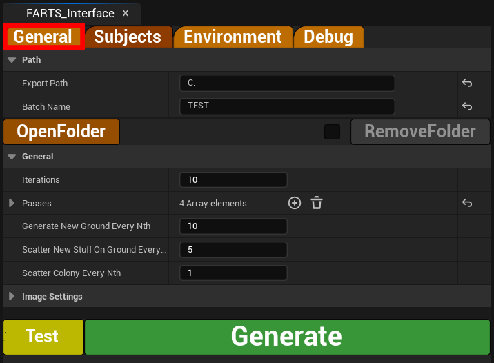
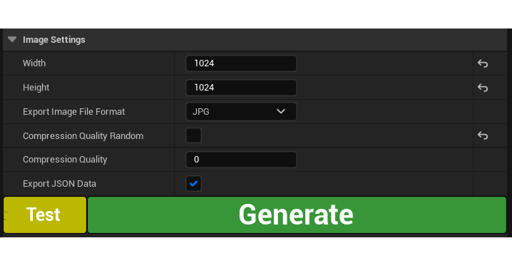
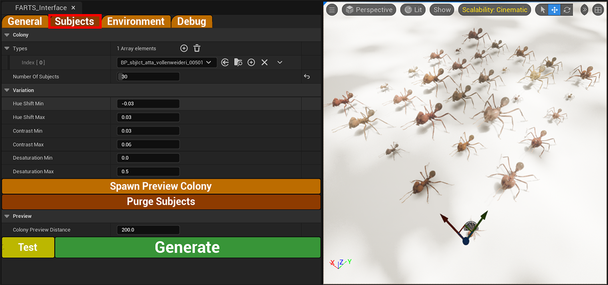
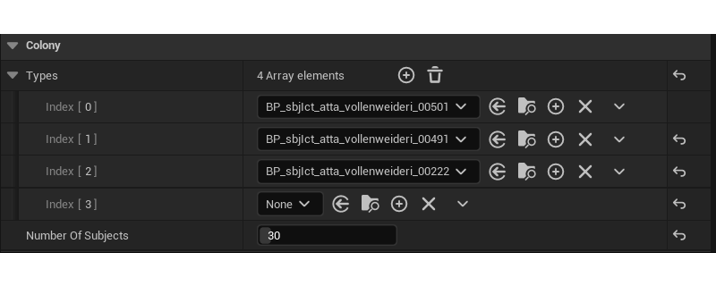

# FARTS

**F**abi **A**nd **R**ené's **T**raining-data **S**ynthesizer


Generating synthetic datasets to improve inference on all sorts of computer-vision tasks that specifically involve
insects. Like, lots of them.

# Generating your first dataset

We aim to make the data generation as straight forward as possible, while providing maximal variability. 
Here, we will briefly outline how to use the generator project within the Unreal Engine 5 Editor, once you have
acquired a suitable input subject 3D model (see [01](01_Retopologising_3D_models.md), [02](02_Rigging_3D_models.md), 
[03](03_Bringing_3D_models_into_Unreal_guide.md)).

The generator setup process is the same for all desired output datatypes. A single generated dataset can therefore be
used to train a variety of networks through the use of our provided [data parsers](../UE5_parsers).

*For additional details (including which settings have been used in our examples) refer to the official publication.*

## Requirements:

* Unreal engine (installed via Epic Games Launcher, see above, v5.0.2 or later)
* Your [retopologised](01_Retopologising_3D_models.md) and [rigged](02_Rigging_3D_models.md) subject 3D model(s)
  [brought into Unreal Engine](03_Bringing_3D_models_into_Unreal_guide.md)

## Basic configuration

Most functionality required to produce training datasets using FARTS is exposed through the **FARTS Interface**.

First, open the [**FARTS.uproject**](../FARTS.uproject) file.
Then, simply **double-click** on one of the **.umap** example files under **/Content/Generator_config**.

### The FARTS Interface

The **FARTS Interface** should be open by default, located at the top left of the **Editor Window**. If that is not the
case, simply **right-click** on **FARTS_Interface** in the **Content** folder and select **Run Editor Utility Widget**.


The **FARTS Interface** consists of four separate tabs, each to configure a different aspect of the data generation process.

#### 1. General



* **Path**
  * ```Export Path``` - Specifies the output location of your generated dataset
  * ```Batch Name``` - The name of your dataset and name of the sub-folder which will contain the generated dataset in the
  specified ```Export Path```. 
  
    > **NOTE** : **DO NOT** include any "_" underscores in the **Batch Name**. Instead, use "-" or " " to separate words as
    underscores are used in later [parser stages](../UE5_parsers) to distinguish different generated passes and data-types.

* **General**
  * ```Iterations``` - Specify how many iterations (unique samples, comprising image passes and annotation files) you want
  to generate
  * ```Passes``` - Specify which image passes are to be exported in each iteration. By default, all passes are exported.
  However, in our example applications we predominantly make use of the **FinalColor** and **ID** passes. You can add
  passes by clicking on the (+) icon, or remove passes by clicking on the downwards-pointing arrow next to each pass
  element. 
  
    
  
  * **Randomisation Updates**
    * ```Generate New Ground Every Nth``` - Update the ground plane every n<sup>th</sup> iteration
    * ```Scatter New Stuff on Ground Every Nth``` - Update all asset scatterers every n<sup>th</sup> iteration
    * ```Scatter Colony Every Nth``` - Update the location and pose of all subjects every n<sup>th</sup> iteration
    
      > **NOTE** : *The **ground plane** is the lowest hierarchical level, meaning all elements placed on top of it will 
  also be regenerated every time it is updated. The scattered assets in turn influence the placement of the subjects of 
  colony. Therefore, the lower in this list the element appears, the more frequently (corresponding to lower values) it 
  should be updated to be computationally efficient. As all materials and the camera placement and parameters are 
  updated at every iteration, high variability can be achieved even with infrequent updates of **ground plane** and 
  **scatterers**.*
  
  * **Image Settings**
    * ```Width``` / ```Height``` - Output dimensions of all passes
    * ```Export Image File Format``` - Output format of the **Final Color** Pass. All other passes remain unaffected and
    will be writen out as uncompressed **.png** files.
    * ```Compression Quality Random``` - Random output compression of the **Final Color** Pass. All other passes remain 
    unaffected and will be writen out as uncompressed **.png** files.
    * ```Compression Quality ``` - Fixed percentage output compression of the **Final Color** Pass. All other passes 
    remain unaffected and will be writen out as uncompressed **.png** files.
    * ```Export JSON Data``` - Export the data (annotation) file. 
      > **NOTE**: In all our provided examples **data (annotation) files** are required.
  
    

#### 2. Subjects

The **Subjects** tab allows the user to configure the composition and appearance of the simulated colony.



* **Colony**
  * ```Types``` - List, comprising all subjects part of the simulated colony.
    
  You can add subjects by clicking on the (+) icon, or remove passes by clicking on the downwards-pointing arrow next to
  each subject element. Make sure, not to remove all **None** entries from the list.
  * ```Number Of Subjects``` - Number of simulated subjects comprising the colony. For each, one subject will be
  randomly drawn from the list of subjects and the **Variation** within the range specified below applied.
 

* **Variation**
  * ```Hue Shift Min``` / ```Hue Shift Max``` - range of percentage hue shift (HLS colour space) for the subjects' 
  albedo (colour) map *(higher = "more red", lower = "more green")*
  * ```Contrast Min``` / ```Contrast Max``` - range of contrast shift for the subjects' 
  albedo (colour) map
  * ```Desaturation Min``` / ```Desaturation Max``` - range of desaturation (HLS colour space) for the subjects' 
  albedo (colour) map  *(higher = "less saturated colours", lower = "more saturated colours")*


* **Spawn Preview Colony** - Spawns a randomised preview of a colony applying the above settings on the 
**Preview Plane** (Located above the simulated environment. Click into the viewport, then hold the **left & right mouse 
button** to move the view upwards and view the **preview colony**)
* **Purge Subjects** - Removes all currently spawned subjects (applies to both **preview colony** and subjects placed
in the procedurally generated environment.)

  > **NOTE** : Click on **Purge Subjects** before generating a dataset, in case you have spawned a preview colony.

* **Preview**
  * ```Colony Preview Distance``` - Determines the spacing between subjects on the **preview plane**. This does not
  affect the spacing of individuals during the data generation process.

#### 3. Environment

In the **Environment** tab, you can specify elements relating to lighting, post-processing, and world generation.


* **Environment**
  * ```HDRIs``` - list of all HDRIs (High Dynamic Range Images) the generator will draw from when lighting the 
  environment. This is where new HDRIs can be added, ones loaded into the Unreal Project.
  * ```Fog Is Volumetric``` - Whether to tread the fog as volumetric during post-processing
  * ```Maximum Fog Density``` - Level of fog density / opaqueness
* **Ground Generation**
  * ```Tessellation Level``` - number of "sub-divisions" performed on the **ground plane** 
  *(higher = "more finely resolved ground plane", lower = "more coarsly resolved ground plane")*

#### 4. Debug

The **Debug** tab can be used to set the randomisation seed and add delays to the data generation process.


* **Random**
  * ```Random Seed``` - If enabled, a random seed will be chosen for the dataset generation process and written out to
  the batch data file.
* **Seed**
  * ```Seed``` - Explicitly set the Seed to repeatedly produce the same variation.
    > **NOTE** : changing the colony size, ground tesselation, or scattered assets will result in different
      output appearances, even with the same seed as it cannot be guaranteed that the same camera poses can
      be assumed.
* **Debug**
  * ```Engine  Warm Up Time``` , ```Iteration  Warm Up Time``` , ```Frame Warm Up Time``` - introduces delays at various
  points in the dataset generation process to combat memory access issues potentially leading to system instability.

## Generate

When all is configured, click on **Generate** at the bottom of any **FARTS_Interface** tab to begin the dataset
generation process.

 

The combination of image passes, and data files constitute synthetic datasets that can be used to train networks 
specialised for a large variety of deep learning-based computer vision applications, including
[detection](../UE5_parsers/Generate_YOLO_Style_Dataset_JSON.ipynb), 
[tracking](https://github.com/FabianPlum/OmniTrax), 
[2D pose estimation](../UE5_parsers/Generate_DLC_Style_Dataset.ipynb) as well as
[3D pose estimation](../UE5_parsers/Generate_Custom_3D_Dataset.ipynb), and
[semantic segmentation](../UE5_parsers/Generate_mmlab_segmentation_Style_Dataset.ipynb).


### Advanced settings

*(Following soon)*

* changing subject size (-range)
* changing camera settings
* custom animation blueprints
* configure scene lighting
* configure asset scatterers

### Next up:

> [**05 Adding custom assets and scatterers**](05_Adding_custom_assets_and_scatterers.md)