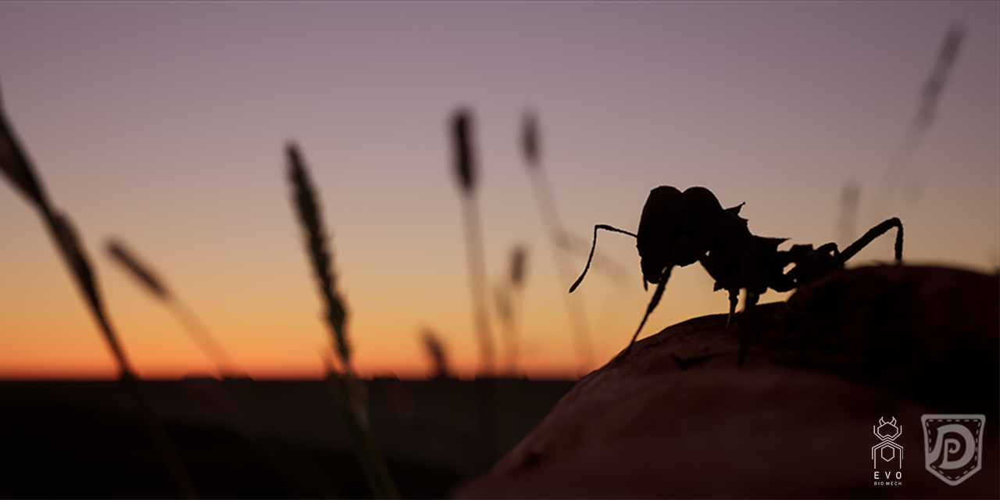

# replicAnt

"generating annotated images of animals in complex environments with Unreal Engine"

by [Fabian **Plum**](https://twitter.com/fabian_plum),
[René **Bulla**](https://twitter.com/renebulla),
[Hendrik **Beck**](https://twitter.com/Hendrik_Beck),
[Natalie **Imirzian**](https://twitter.com/nimirzy),
and [David **Labonte**](https://twitter.com/EvoBiomech) (2023)

___

___

## Example samples

### _Atta vollenweideri_ - multi animal dataset:

The following samples are part of the datasets used to train detection, semantic segmentation, and classifier networks, as
presented in [***replicAnt* - generating annotated images of animals in complex environments with Unreal
Engine**](https://www.biorxiv.org/content/10.1101/2023.04.20.537685v1)

<table style="padding:10px">
  <tr> 
   <td></td>
   <td></td>
   <td></td>
  </tr>
  <tr> 
   <td></td>
   <td></td>
   <td></td>
  </tr>
  <tr> 
   <td></td>
   <td></td>
   <td></td>
  </tr>
  <tr> 
   <td></td>
   <td></td>
   <td></td>
  </tr>
</table>

### _Sungaya inexpectata_ - single animal dataset:

The following samples are part of the datasets used to pose estimation networks, as
presented in [***replicAnt* - generating annotated images of animals in complex environments with Unreal
Engine**](https://www.biorxiv.org/content/10.1101/2023.04.20.537685v1). DeepLabCut annotation conventions are displayed 
below each sample.

<table style="padding:10px">
  <tr> 
   <td></td>
   <td></td>
   <td></td>
  </tr>
  <tr> 
   <td></td>
   <td></td>
   <td></td>
  </tr>
  <tr> 
   <td></td>
   <td></td>
   <td></td>
  </tr>
  <tr> 
   <td></td>
   <td></td>
   <td></td>
  </tr>
  <tr> 
   <td></td>
   <td></td>
   <td></td>
  </tr>
  <tr> 
   <td></td>
   <td></td>
   <td></td>
  </tr>
</table>

### _Leptoglossus zonatus_ - multi animal dataset:

The following samples are part of the datasets used to semantic segmentation networks, as
presented in [***replicAnt* - generating annotated images of animals in complex environments with Unreal
Engine**](https://www.biorxiv.org/content/10.1101/2023.04.20.537685v1). ID maps are displayed 
below each sample.

<table style="padding:10px">
  <tr> 
   <td></td>
   <td></td>
   <td></td>
  </tr>
  <tr> 
   <td></td>
   <td></td>
   <td></td>
  </tr>
  <tr> 
   <td></td>
   <td></td>
   <td></td>
  </tr>
  <tr> 
   <td></td>
   <td></td>
   <td></td>
  </tr>
  <tr> 
   <td></td>
   <td></td>
   <td></td>
  </tr>
  <tr> 
   <td></td>
   <td></td>
   <td></td>
  </tr>
</table>

---

### Official full datasets:

All datasets, both generated and real, additional SI, and the best performing networks are hosted via Zenodo:

* 3D Models https://zenodo.org/record/7849059 **DOI** : 10.5281/zenodo.7849059
* Detection and Tracking Datasets and Trained networks https://zenodo.org/record/7849417 **DOI** :
  10.5281/zenodo.7849417
* Pose-Estimation Datasets and Trained networks https://zenodo.org/record/7849596 **DOI** : 10.5281/zenodo.7849596
* Semantic And Instance Segmentation Datasets and Trained networks https://zenodo.org/record/7849570 **DOI** :
  10.5281/zenodo.7849570

___

> In case you encounter any problems, consult our [troubleshooting guide](troubleshooting.md), or consider raising an
> **issue** on the replicAnt GitHub page.

## License

© Fabian Plum, Rene Bulla, David Labonte 2023
[MIT License](https://choosealicense.com/licenses/mit/)
