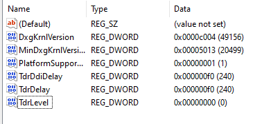

# FARTS

**F**abi **A**nd **R**ené's **T**raining-data **S**ynthesizer


Generating synthetic datasets to improve inference on all sorts of computer-vision tasks that specifically involve
insects. Like, lots of them.

# Troubleshooting

## 1. Unreal Engine Randomly Crashes

As there can be plenty of reasons WHY Unreal Crashes with seemingly random error codes pointing to 
various **EXCEPTION_ACCESS_VIOLATION** addresses, I have compiled here the most common fixes.

### 1.1 Decreasing the number of meshes in the scene

The simplest fix, which often suffices on systems with limited **RAM** or **VRAM**, is to simply decrease the number
of meshes (and/or their complexity) simultaneously occupying memory in your scene. This can be done by changing one of
these three parameters:
1. **Tesselation level** - Decrease the **Tesselation Level** in the **User Interface** > **Environment** tab. The
default level of ```30``` (influencing the number of subdivision and thus mesh complexity of the ground plane) is too
high for some systems.
2. **Asset Scatterers** - Decrease the number of **assets** each asset scatterer can minimally and maximally spawn.
In some instances, while the system would have sufficient RAM / VRAM to load all scattered assets, the Unreal
Instance has an upper limit as to how many objects can persist in a scene concurrently.
3. **Colony size** - While this is understandably the last parameter one would want to change, depending on the 
application, the number of subjects simulated greatly affects the generator performance. Decreasing the number of
subjects can aid in improving the system stability.

### 1.2 Switching to legacy versions of DirectX
In case of frequent crashes (Windows 10 & 11 OS), stating EXCEPTION ACCESS VIOLATION of various read & write addresses, 
consider switching from DirectX 12 to DirectX11:

In the **Unreal Engine Project Settings > Platforms - Windows > Targeted RHIs**
setting the Default RHI to DirectX 11

**WARNING:**  Switching to DirectX 11 is a temporary fix, as the rendering performance and image quality of the resulting 
samples may decrease. As this is a Windows system issue we cannot provide support or a specific timeline of when the 
underlying issue will be addressed.

### 1.3 Editing registry entries

Editing registry entries can help to ensure rendering delays do not terminate applications. Open the **Registry Editor**
and edit the following entries under ```Computer\HKEY_LOCAL_MACHINE\SYSTEM\CurrentControlSet\Control\GraphicsDrivers```



**TdrLevel** - Specifies the initial level of recovery.

      KeyPath   : HKEY_LOCAL_MACHINE\System\CurrentControlSet\Control\GraphicsDrivers
      KeyValue  : TdrLevel
      ValueType : REG_DWORD
      ValueData : TdrLevelXxx (see the following table)

Where TdrLevelXxx can be one of the following values:

```ValueMeaningTdrLevelOff (0)``` - Detection disabled

```TdrLevelBugcheck (1)``` - Bug check on detected timeout; for example, no recovery.

```TdrLevelRecoverVGA (2)``` - Recover to VGA (not implemented).

```TdrLevelRecover (3)``` - Recover on timeout. This is the default value.

**TdrDelay** - Specifies the number of seconds that the GPU can delay the preempt request from the GPU scheduler. 
This is effectively the timeout threshold.

      KeyPath     : HKEY_LOCAL_MACHINE\System\CurrentControlSet\Control\GraphicsDrivers
      KeyValue    : TdrDelay
      ValueType   : REG_DWORD
      ValueData   : Number of seconds to delay. The default value is 2 seconds.
      
**TdrDdiDelay** -  Specifies the number of seconds that the OS allows threads to leave the driver. 
After a specified time, the OS bug-checks the computer with the code VIDEO_TDR_FAILURE (0x116).

      KeyPath   : HKEY_LOCAL_MACHINE\System\CurrentControlSet\Control\GraphicsDrivers
      KeyValue  : TdrDdiDelay
      ValueType : REG_DWORD
      ValueData : Number of seconds to leave the driver. The default value is 5 seconds.


## 2. "root" bone in armature prevents assigning skeletal mesh

As of **Blender 2.93.2**, the following solution which allows you to use ANY name for your armature and export without
the extra bone should apply:

Source: [Prevent Blender FBX Exporter adding extra root bone](https://forums.unrealengine.com/t/tutorial-how-to-remove-extra-root-bone-from-blender-armature-and-retarget/409535)

1. Download and install Notepad++ 13 or another editor.
2. Navigate to the “io_scene_fbx” folder in your Blender installation directory.

```bash
  e.g. .../blender-2.93.2-windows-x64/2.93/scripts/addons/io_scene_fbx
```

3. **IMPORTANT**: Create a back-up copy of the file “export_fbx_bin.py” on your Desktop or somewhere else in
   case you make a mistake or want to go back to the previous behavior.
4. Now double-click and open “export_fbx_bin.py” with Notepad++ or your preferred editor.
5. As of **Blender >2.93.2**, you should see the following on lines ```2575 to 2577```:

```bash
      2575:  elif ob_obj.type == 'EMPTY' or ob_obj.type == 'ARMATURE':
      2576:     empty_key = data_empties[ob_obj]
      2577:     connections.append((b"OO", get_fbx_uuid_from_key(empty_key), ob_obj.fbx_uuid, None))
 ```

6. Comment out these lines by adding a “#” at the start of each:

```bash
   2575: #elif ob_obj.type == 'EMPTY' or ob_obj.type == 'ARMATURE':
   2576: #   empty_key = data_empties[ob_obj]
   2577: #   connections.append((b"OO", get_fbx_uuid_from_key(empty_key), ob_obj.fbx_uuid, None))
 ```

7. Save the “export_fbx_bin.py” file in Notepad++ or your editor.
8. Restart Blender.